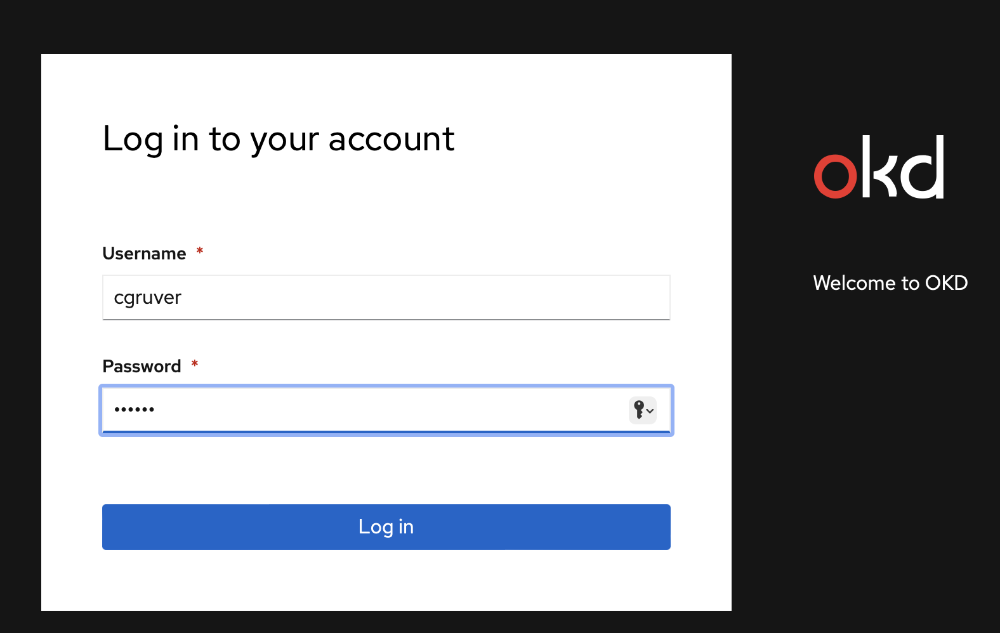
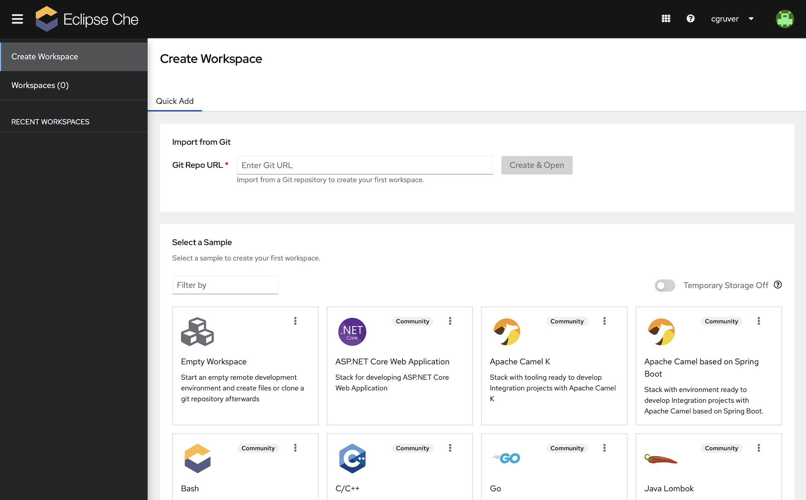
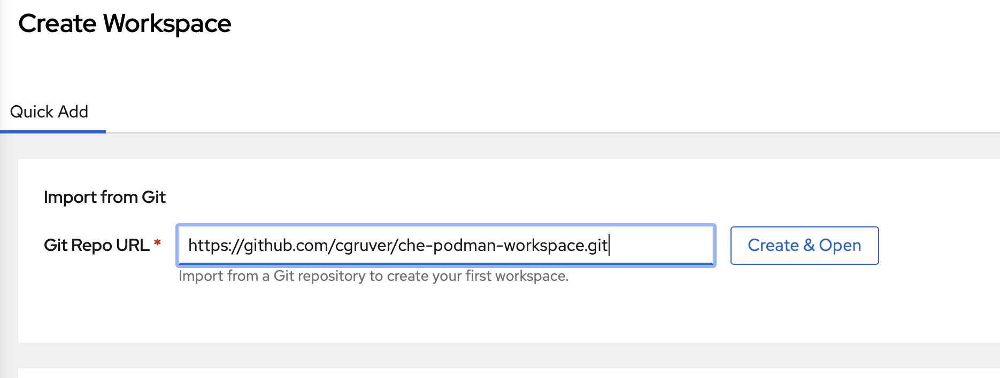
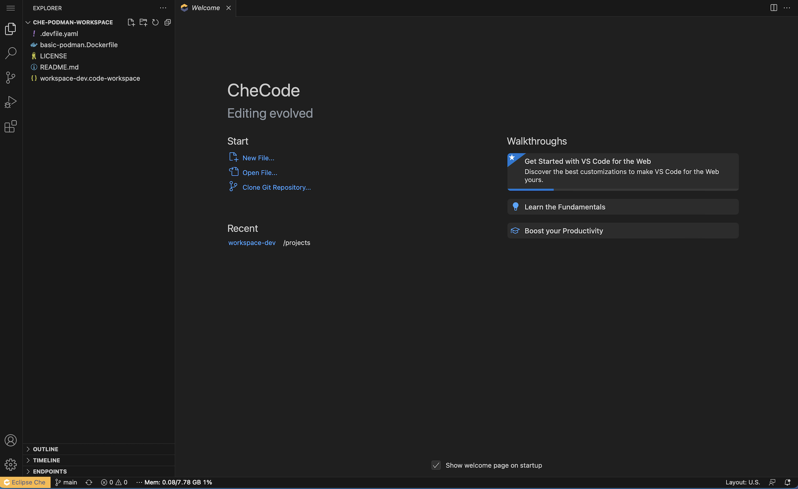
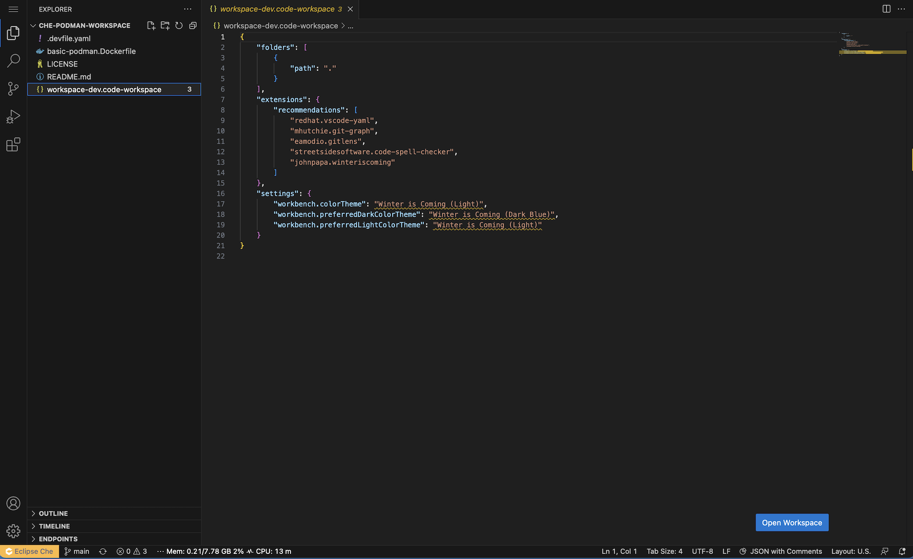
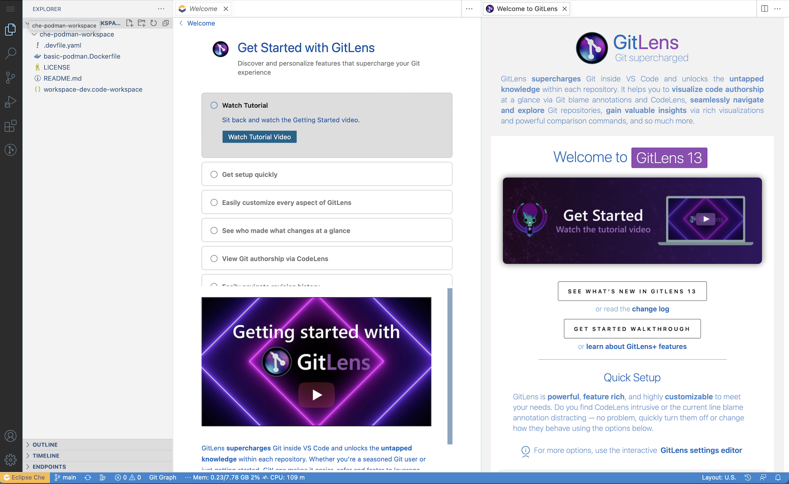

# Eclipse Che & OpenShift Dev Spaces Sample Project for Podman Container Development

This project is intended to serve as a quick demo for using `podman` in Eclipse Che or its downstream, Red Hat supported sibling, OpenShift Dev Spaces.

There are two specific things being demo'd here:

1. Enabling container development in Eclipse Che & building a custom image for a workspace.
1. Creating a Devfile to use the custom image.
1. Customizing the VS Code editor in the workspace.

Let's get started.

## Enabling Container Development in Eclipse Che

There are two things necessary to develop container images in Eclipse Che:

1. Enable the Dev Workspaces Operator to use a security context that enables rootless container builds.
1. Create a Workspace with an image that is enabled for container development.

### Enable Eclipse Che for Container Development

The first step is really easy, but needs cluster admin.  You need to flip a toggle on the CheCluster Custom Resource to enable container development.

Execute the following with cluster-admin privileges:

```bash
oc patch CheCluster <NAME_OF_YOUR_CHE_CLUSTER_CR> -n <NAMESPACE_WHERE_THE_CHE_CLUSTER_IS_INSTALLED> --type merge --patch '{"spec":{"devEnvironments":{"disableContainerBuildCapabilities":false}}}'
```

For a default install of Eclipse Che the command will look like:

```bash
oc patch CheCluster eclipse-che -n eclipse-che --type merge --patch '{"spec":{"devEnvironments":{"disableContainerBuildCapabilities":false}}}'
```

For OpenShift Dev Spaces, the command is the same, but the namespace where the CheCluster CR lives is likely different, and the name of the CheCluster CR might be different.

Your instance of Eclipse Che is now ready to allow container development.

### Create a Custom Image for Container Tools

Next, let's create a container image that our workspace can use to provide `podman` and some other tools for rootless container development.

I've provided a Dockerfile for you as an example:

```dockerfile
FROM registry.access.redhat.com/ubi9/ubi-minimal

ARG USER_HOME_DIR="/home/user"
ARG WORK_DIR="/projects"

ENV HOME=${USER_HOME_DIR}
ENV BUILDAH_ISOLATION=chroot

RUN microdnf --disableplugin=subscription-manager install -y openssl compat-openssl11 libbrotli git tar which shadow-utils bash zsh wget jq podman buildah skopeo; \
    microdnf update -y ; \
    microdnf clean all ; \
    mkdir -p ${USER_HOME_DIR} ; \
    mkdir -p ${WORK_DIR} ; \
    chgrp -R 0 /home ; \
    chgrp -R 0 ${WORK_DIR} ; \
    #
    # Setup for root-less podman
    #
    setcap cap_setuid+ep /usr/bin/newuidmap ; \
    setcap cap_setgid+ep /usr/bin/newgidmap ; \
    mkdir -p "${HOME}"/.config/containers ; \
    (echo '[storage]';echo 'driver = "vfs"') > "${HOME}"/.config/containers/storage.conf ; \
    touch /etc/subgid /etc/subuid ; \
    chmod -R g=u /etc/passwd /etc/group /etc/subuid /etc/subgid /home ${WORK_DIR} ; \
    echo user:20000:65536 > /etc/subuid  ; \
    echo user:20000:65536 > /etc/subgid

USER 10001
WORKDIR ${WORK_DIR}
```

Let's break this down:

1. Note that we're starting with a UBI Minimal image.  This helps to keep our resulting container image as small as possible.
1. We're specifying two arguments:
   1. USER_HOME_DIR - To set the home directory for the user
   1. WORK_DIR - To set the working directory for the running container.

   __Note: The defaults for these ARGs are set to Eclipse Che conventions.

1. We are using `microdnf` to install packages and update the installed packages so that our container is all patched up.

   1. We are installing `podman`, `buildah`, and `skopeo` as our container development tools.

   1. We are installing `shadow-utils` because it is needed for rootless `podman`.

   1. We are installing `openssl`, `compat-openssl11`, and `libbrotli` because they are needed by VS Code which is now the default editor in Che.

   1. We are installing `bash`, and `zsh` as shell options.  __Note:__ `bash` is the default shell.

   1. We are installing `git`, `tar`, `which`, `wget`, and `jq` as useful tools.  Add your favorites to the list.

1. We are creating the home directory and working directory, then setting permissions so that our user can access them with a random uid.  The uid at runtime will belong to group `0`.

1. Next we are using `setcap` to ensure that our user at runtime can execute `newuidmap` and `newgidmap`.  __Note:__ This is a bit of secret sauce necessary to enable rootless podman.  Out of the box, shadow-utils does not have the correct permissions to allow rootless podman.

1. Native `overlayfs` does not work yet for nested containers with an overlay filesystem, nor does `fuse-overlayfs` work yet for rootless podman.  So, in this next step we are creating a `storage.conf` file that tells buildah and podman to use `vfs`.  It's slow, but not horrible.

1. In the next step, we are setting permissions on some of the shadow-utils files to allow our workspace to create the appropriate entries for our user when the workspace initializes.  __Note:__ There is an init container that creates the appropriate entries for us when our workspace starts.  It's part of the Che boiler plate.

1. Finally, we are creating entries in `subuid` and `subgid` that enable our development container to run in a namespace with its own set of UIDs and GIDs, so that we can be root in our development containers.

I have a pre-built instance of this container image here: `quay.io/cgruver0/che/podman-basic:latest`

In the next section, we'll create a Devfile that uses it in a Che workspace.

## Basic Devfile for Container Development

This project includes a basic Devfile that you can use out of the box to create a workspace in Eclipse Che for building images with rootless podman.

```yaml
schemaVersion: 2.2.0
attributes:
  controller.devfile.io/storage-type: per-workspace
metadata:
  name: podman-dev
components:
- name: podman
  container: 
    image: quay.io/cgruver0/che/podman-basic:latest
    memoryLimit: 6Gi
    mountSources: true
- volume:
    size: 4Gi
  name: projects
```

This is just about as simple as a Devfile can get.  

1. It is specifying one attribute, `controller.devfile.io/storage-type: per-workspace`, which instructs the Dev Workspace Operator to create a PVC for this workspace rather than sharing one across multiple workspaces.

1. The workspace has one component, in this case it's the container images that we talked about above which has the container dev tooling in it.

   1. We're requesting 6GB of RAM.
   1. We're instructing the workspace to expose the project source code in this component: `mountSources: true`

1. The workspace is requesting one persistent volume.

## Customizing VS Code for your Workspace

```json
{
  "folders": [{
      "path": "."
    }],
  "extensions": {
    "recommendations": [
      "redhat.vscode-yaml",
      "mhutchie.git-graph",
      "eamodio.gitlens",
      "streetsidesoftware.code-spell-checker",
      "johnpapa.winteriscoming"
    ]
  },
  "settings": {
    "workbench.colorTheme": "Winter is Coming (Light)",
    "workbench.preferredDarkColorTheme": "Winter is Coming (Dark Blue)",
    "workbench.preferredLightColorTheme": "Winter is Coming (Light)"
  }
}
```

## Putting it all together













