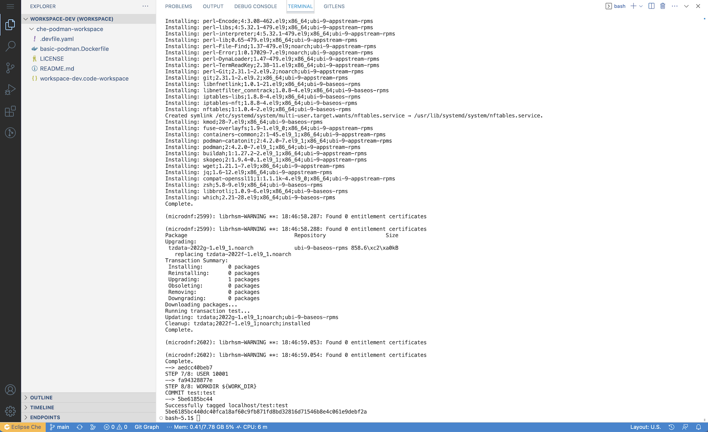

# Building the `podman` image in a cluster without access to `quay.io`

1. First, make a clone of this GitHub repository in a Git repository that the OpenShift cluster can access.

   __Note:__ Unless you already have Eclipse Che set up for authenticated git access, you will need to make this project readable without authentication.

1. Point your browser to the Eclipse Che route.

   For a default install of Eclipse Che, you can get the route by executing:

   ```bash
   oc get route che -n eclipse-che -o jsonpath={.spec.host}
   ```

   For OpenShift Dev Spaces, it will depend on your installation of the CheCluster CR.

1. When your browser loads the URL for the route, you should see something similar to the following:

   

1. Click the `Log in with OpenShift` button.

   __Note:__ Log in with a non-admin user id.

   

   __Note:__ If this is your first time logging in, you will be asked to grant permissions for Che to use OpenShift OAuth to log you in.

1. You should now see the Eclipse Che landing page:

   

### Create the `podman` container image in the OpenShift internal registry

Before we continue in the Eclipse Che UI, we need to pause for a minute and create the `podman` container image.

__Note:__ It is assumed that you are using a non-admin openshift user.

When you logged into Eclipse Che / Dev Spaces for the first time, it created a namespace for your user.  However, your user does not have full admin rights to this namespace.  So, we cannot directly create BuildConfigs or ImageStreams in that namespace.  To work around that, we're going to build a bit of a Rube Goldberg machine...  But, you might learn some new tricks in the process.

1. Open a terminal and log into the OpenShift cluster with the `oc` cli:

   ```bash
   oc login <URL_OF_YOUR_OPENSHIFT_CLUSTER_API> -u <your-openshift-userid>
   ```

1. Create a namespace to host the podman ImageStream:

   ```bash
   oc new-project podman-build
   ```

1. Find the namespace that the Dev Workspace Operator just created for you:

   ```bash
   oc get projects -l app.kubernetes.io/part-of==che.eclipse.org,app.kubernetes.io/component==workspaces-namespace
   ```

   Hopefully this command returns one project name.  If you are logged in as a cluster-admin, then it will list all of the developer namespaces.  So, if you are using a cluster-admin account, then for the next few commands you will use the `openshift` namespace.

   The output on my cluster looks like:

   ```bash
   NAME          DISPLAY NAME   STATUS
   cgruver-che                  Active
   ```

1. Grant the ability for service accounts to pull images from the `podman-build` namespace:

   ```bash
   oc policy add-role-to-user system:image-puller system:serviceaccount:<name-of-your-che-project>:default -n podman-build
   oc policy add-role-to-group system:image-puller system:serviceaccounts -n podman-build
   ```

1. Create an ImageStream to associate the new image with:

   ```bash
   cat << EOF | oc apply -n podman-build -f -
   apiVersion: image.openshift.io/v1
   kind: ImageStream
   metadata:
     name: podman-basic
   EOF
   ```

1. Create a `BuildConfig` to build the image:

   ```bash
   cat << EOF | oc apply -n podman-build -f -
   apiVersion: build.openshift.io/v1
   kind: BuildConfig
   metadata:
     name: podman-basic
   spec:
     source:
       dockerfile: |
         FROM registry.access.redhat.com/ubi9/ubi-minimal
         ARG USER_HOME_DIR="/home/user"
         ARG WORK_DIR="/projects"
         ENV HOME=\${USER_HOME_DIR}
         ENV BUILDAH_ISOLATION=chroot
         RUN microdnf --disableplugin=subscription-manager install -y openssl compat-openssl11 libbrotli git tar which shadow-utils bash zsh wget jq podman buildah skopeo; \
           microdnf update -y ; \
           microdnf clean all ; \
           mkdir -p \${USER_HOME_DIR} ; \
           mkdir -p \${WORK_DIR} ; \
           chgrp -R 0 /home ; \
           chgrp -R 0 \${WORK_DIR} ; \
           setcap cap_setuid+ep /usr/bin/newuidmap ; \
           setcap cap_setgid+ep /usr/bin/newgidmap ; \
           mkdir -p "\${HOME}"/.config/containers ; \
           (echo '[storage]';echo 'driver = "vfs"') > "\${HOME}"/.config/containers/storage.conf ; \
           touch /etc/subgid /etc/subuid ; \
           chmod -R g=u /etc/passwd /etc/group /etc/subuid /etc/subgid /home \${WORK_DIR} ; \
           echo user:20000:65536 > /etc/subuid  ; \
           echo user:20000:65536 > /etc/subgid
         USER 10001
         WORKDIR \${WORK_DIR}
     strategy:
       type: Docker
     output:
       to:
         kind: ImageStreamTag
         name: podman-basic:latest
   EOF
   ```

1. Build the image:

   ```bash
   oc start-build podman-basic -n podman-build -w -F
   ```

1. Verfy  the new tag on the `imageStream`

   ```bash
   oc get is podman-basic -n podman-build
   ```

   You should see output similar to:

   ```bash
   NAME           IMAGE REPOSITORY                                                          TAGS     UPDATED
   podman-basic   image-registry.openshift-image-registry.svc:5000/podman-build/podman-basic   latest   4 minutes ago
   ```

1. Modify the `.devfile.yaml` in your copy of this code repo to use your new image:

   Edit the file `.devfile.yaml` and replace:

   `quay.io/cgruver0/che/podman-basic:latest`

   with:

   `image-registry.openshift-image-registry.svc:5000/podman-build/podman-basic`

Now, you should be able to use the git repository URL of your clone of this project to build the workspace.

### Go back to the Eclipse Che / OpenShift Dev Spaces Console

1. Create a Workspace with this project:

   Paste the URL for your clone of this Git project into the form as shown below, and click `Create & Open`

   

   This action does several things to create your workspace:

   1. It clones this Git repo.
   1. It finds the `.devfile.yaml` and uses it to configure a DevWorkspace Custom Resource with the Dev Workspace Operator.
   1. The DevWorkspace creates a PVC and attaches it to a pod.
   1. It then adds the code from this repository to the /projects mount in the `podman` container.  (refer back to the .devfile.yaml for the container name)
   1. It also runs an init container which injects the che-code (VS Code) editor into the `podman` container.
   1. It starts VS Code and exposes it to your browser.

1. The workspace should now open VS Code in your browser:

   

1. In the running instance of VS Code, click on the file `workspace-dev.code-workspace`

   You should see a button, `Open workspace` down in the bottom right hand corner.  Click on it.

   

1. VS Code will open the workspace.

   In a few moments, you should see some changes.

   1. The color theme will change to a light theme.  (Apologies...  I like light themes...  You can change it back.)
   1. You will see the page for the GitLens extension load.

   If you click on the extensions icon in the left-hand vertical nav bar, you will see that several extensions are now installed.

   

VS Code is now running in your browser!

To get to the menu that you are used to seeing in the top nav bar on your workstation, click on the hamburger menu in the top left-hand corner.  We'll use that in a moment to open a terminal.

To get to VS Code settings, click on the gear icon in the bottom left-hand corner.

You can access your workspace account from the icon just above the gear.

## Let's build a container

1. Open a terminal:

   

1. Build a container:

   In the terminal, run the following:

   ```bash
   podman build -t test:test -f basic-podman.Dockerfile .
   ```

   

That's It!

__Note:__ Running containers in this configuration does not work yet with this example.  Stay tuned.
